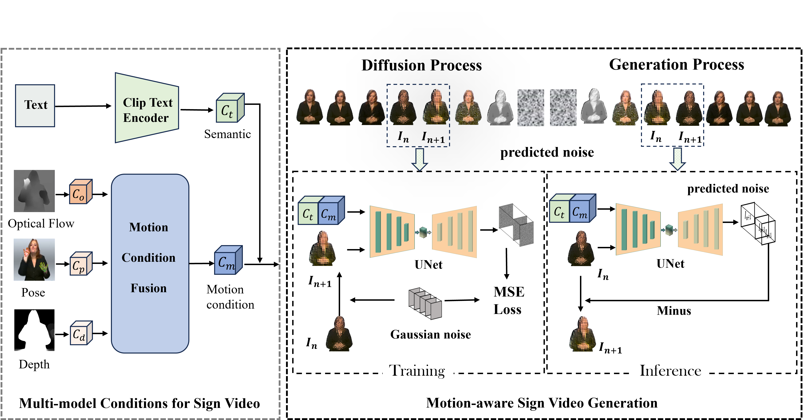

<h1 align="center"> SignGen: End-to-End Sign Language Video Generation with Latent Diffusion</h1>

Official repo for [SignGen: End-to-End Sign Language Video Generation with Latent Diffusion](https://openreview.net/forum?id=qLuwGkbEAs)


## Method




## Experiment Results

#### RWTH-2014

   
   

## Running by Yourself

### 1. Installation 

create a conda environment.
```
conda create -n  xxx  python==3.8.5 
```

Then you  can create the same environment as ours with the following command:
```
 pip install -r requirements.txt # install all requirements # install all requirements
```

### 2. Download model weights

#### For LPIPS

The code will do it for you!
> Code will download https://download.pytorch.org/models/alexnet-owt-7be5be79.pth and move it into: `models/weights/v0.1/alex.pth`

#### For FVD

The code will do it for you!

> Code will download i3D model pretrained on Kinetics-400 from "https://onedrive.live.com/download?cid=78EEF3EB6AE7DBCB&resid=78EEF3EB6AE7DBCB%21199&authkey=AApKdFHPXzWLNyI"
> Use `models/fvd/convert_tf_pretrained.py` to make `i3d_pretrained_400.pt`

### 3. Datasets

You can download these datasets such  as RWTH-2014(https://www-i6.informatik.rwth-aachen.de/~koller/RWTH-PHOENIX/),RWTH-2014T(https://www-i6.informatik.rwth-aachen.de/~koller/RWTH-PHOENIX-2014-T/) and AUTSL(https://chalearnlap.cvc.uab.cat/dataset/40/data/66/description/).

> **How the data was processed:**
> 1. Download  AUTSL dataset to `/path/to/AUTSL`:\
> 2. Convert 128x128 images to HDF5 format:\
> `python datasets/sign_language_convert.py --sl_dir 'datasets/videos' --split 'train'  --out_dir 'datasets/signLanguages/train' --image_size 128  --force_h5 False

### Training

You can train  with 2 GPUs using:
```
CUDA_VISIBLE_DEVICES=0,1 python main.py --config configs/sign_language.yml --data_path data_path --exp log_path --ni
```
